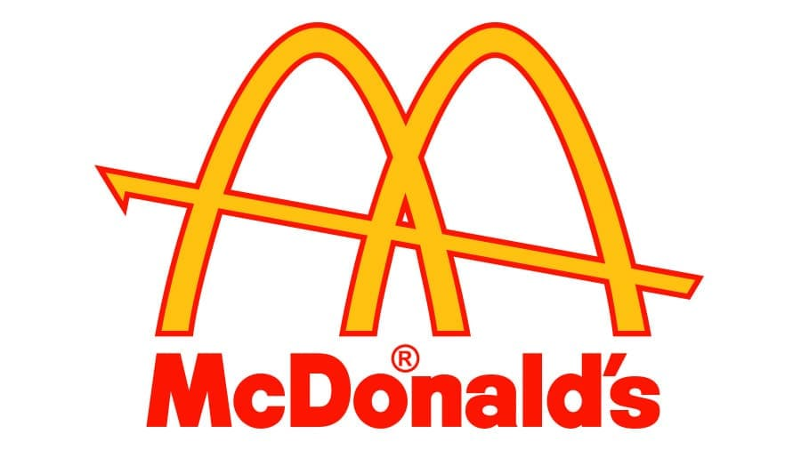
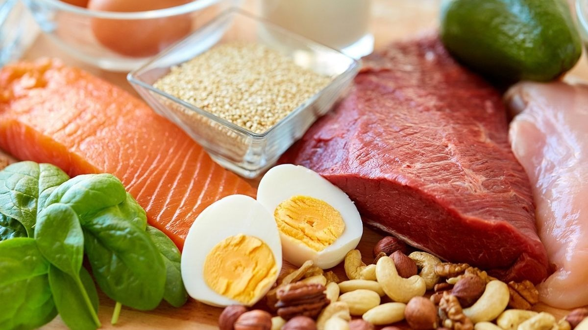
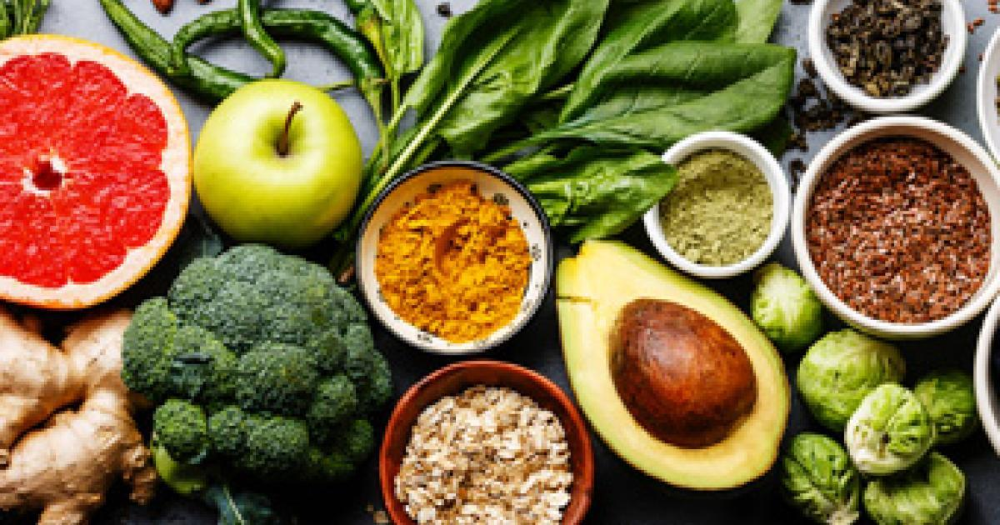

                        
```{r setup, include=FALSE}
knitr::opts_chunk$set(echo = TRUE)
```

```{r packages-setup, include = FALSE}
library(ggplot2)
library(dplyr)
library(reactable)
library(gt)
library(tibble)
library("plotly")
library(tidyverse)
library(hrbrthemes)
library(viridis)
library(patchwork)
library(gganimate)
library(wordcloud2)
library(webshot)
library(corrplot)
library(sqldf)
library(RColorBrewer) 
library(kableExtra)

menu <- rio::import("./datos/menu1.1.csv")
restaurantesUS <- rio::import("./datos/FastFoodRestaurants.csv")
fastfoodrestaurants <- rio::import("./datos/fastfoodrestaurants.csv")
fastfoodrestaurants19 <-rio::import("./datos/Datafiniti_Fast_Food_Restaurants_May19.csv")
ingresos <- rio::import("./datos/ingresos1.csv")
ventas <- rio::import("./datos/sales.csv")
```

##  ÍNDICE   

> - Introducción, Breve Historia y Logos
> - Restaurantes Fast Food
> - Ingresos de los restaurantes
> - Categorías por productos
> - Valores nutricionales
> - Productos con mayor macronutrientes
> - Productos con mayor micronutrientes
> - Correlación
> - Tipos de alimentos
> - Popularidad
> - Conclusión


## INTRODUCCIÓN

 </center>


## BREVE HISTORIA


## LOGOS

``` {r echo=FALSE, out.width = "250px", out.height="100px",fig.align='center'}


```


``` {r echo=FALSE, out.width = "250px", out.height="100px",fig.align='center'}


```


``` {r echo=FALSE, out.width = "250px", out.height="100px",fig.align='center'}


```

``` {r echo=FALSE, out.width = "250px", out.height="100px",fig.align='center'}


```


##


``` {r echo=FALSE, out.width = "250px", out.height="120px",fig.align='center'}


```


``` {r echo=FALSE, out.width = "250px", out.height="120px",fig.align='center'}
knitr::include_graphics("./imagenes/logo6.jpg")

```


``` {r echo=FALSE, out.width = "250px", out.height="120px",fig.align='center'}


```


``` {r echo=FALSE, out.width = "250px", out.height="120px",fig.align='center'}


```

## RESTAURANTES FAST FOOD
```{r echo=FALSE, eval=TRUE, warning= FALSE}
mas_restaurantes <- restaurantesUS %>% 
  group_by(name) %>% 
  mutate(n_restaurantes = sum(NN = n())) %>%
  distinct(name, n_restaurantes) %>%
  arrange(desc(n_restaurantes)) %>%
  filter(n_restaurantes >=192) 

  gg_restaurantes <- ggplot(mas_restaurantes, aes(name, n_restaurantes)) +
  geom_bar(stat = "identity")
  
gg_restaurantes
```


## INGRESOS RESTAURANTES FAST FOOD

```{r echo=FALSE, eval=TRUE, warning= FALSE}
 df_ingresos <- ggplot(ingresos, aes(x=reorder(Resturantes, Value), y=Value, fill=Resturantes))+
  geom_bar(stat="identity") +
  theme(legend.position = "none") +
  coord_polar(start = 0.01) +
  labs (x="Restaurantes") + labs(y="Miles de millones de dólares") + labs(title = "Ingresos de los Resturantes FastFood") + labs(subtitle = "En miles de millones de dólares")

df_ingresos
```


## CATEGORIAS POR PRODUCTOS 
```{r echo=FALSE, eval=TRUE, warning= FALSE}
m <- list(
  l = 50,
  r = 50,
  b = 100,
  t = 100,
  pad = 4
)
marker = list(color = brewer.pal(9, "Set1"))
p <- plot_ly(
  x = menu$Category,
  marker = list(color = '#CD0BBC'),
    type = "histogram"
)%>%
  layout(         xaxis = list(title = ""),
         yaxis = list(title = ""),
         autosize = T)
p
```


## VALORES NUTRICIONALES 

```{r echo=FALSE, eval=TRUE, warning= FALSE}
df_calorias <- menu %>%
select(Item, Calories) 

dftop1 <- df_calorias %>% slice_max(Calories, n=1)

Imagen <- "https://i.pinimg.com/originals/d5/5f/03/d55f035c37d84ec55934ba6d469bedce.jpg"

dftop1 <- dftop1 %>% add_column(Imagen)

Tabla_Pmascal <- dftop1 %>% gt()

Tabla_Pmascal <- Tabla_Pmascal %>%
                   tab_header(title = md("*Producto con mas calorias*"))
                   
Tabla_Pmascal <- Tabla_Pmascal %>%
                tab_options(heading.background.color = "coral") %>% tab_options(heading.title.font.size = 15,  column_labels.font.weight =  "bold")


Tabla_Pmascal <- Tabla_Pmascal  %>%
  gt::text_transform(locations = cells_body(columns = c(Imagen)), fn = function(x) {gt::web_image(x, height = 50)}) %>%  cols_align(
   align = "center")

Tabla_Pmascal
```


-


-


-

```{r echo=FALSE, eval=TRUE, warning= FALSE}
dfmin1 <- df_calorias %>% 
slice_min(Calories, n=1) %>%
filter (Item == "Dasani Water Bottle") #Dasani Water Bottle es uno de los productos con menos calorias 

Imagen <- "https://i.pinimg.com/originals/3c/df/ae/3cdfaeaa504db8aaf100843a12aacc97.png"

dfmin1 <- dfmin1 %>% add_column(Imagen)


Tabla_Pmincal <- dfmin1 %>% gt()

Tabla_Pmincal <- Tabla_Pmincal %>%
                   tab_header(title = md("*Producto con menos calorias*"))
                   
Tabla_Pmincal <- Tabla_Pmincal %>%
                tab_options(heading.background.color = "coral") %>% tab_options(heading.title.font.size = 15,  column_labels.font.weight =  "bold")


Tabla_Pmincal <- Tabla_Pmincal  %>%
  gt::text_transform(locations = cells_body(columns = c(Imagen)), fn = function(x) {gt::web_image(x, height = 50)}) %>%  cols_align(
   align = "center")

Tabla_Pmincal
```


## PRODUCTOS CON MAYORES MACRONUTRIENTES

``` {r echo=FALSE, out.width = "600px", out.height="400px",fig.align='center'}


```


## PROTEINAS

```{r echo=FALSE, eval=TRUE, warning= FALSE, fig.align="center", out.width = "90%"}
df14prod <- menu %>%
  select(Item, Protein) %>%
  head(Protein, n = 10L)%>%
  group_by(Item, Protein) %>%
  arrange(desc(Protein))

wordcloud2(data=df14prod, size=0.1)
```


## GRASAS
```{r echo=FALSE, eval=TRUE, warning= FALSE}

totalfat <- menu %>%
 select(Item, Fat) 


df_fat <- totalfat %>%
head(Fat, n= 10L) %>%
group_by(Item, Fat) %>%
arrange(desc(Fat))


plot_ly(x = df_fat$Item, y=df_fat$Fat,color = df_fat$Item,colors = palette("Pastel 2"), type = "box") %>% 
  layout(title = "Los 10 productos con más grasa",
         xaxis = list(title = ""),
         yaxis = list(title = ""),
         showlegend=FALSE,
         autosize = T)
```

## CARBOHIDRATOS
```{r echo=FALSE, eval=TRUE, warning= FALSE}
carbos <- menu %>%
select(Item,Carbohydrates)

df_carbos <- carbos %>%
head(Carbohydrates, n= 10L) %>%
group_by(Item, Carbohydrates) %>%
arrange(desc(Carbohydrates))

plot_ly(x = df_carbos$Item, y=df_carbos$Carbohydrates,color = df_carbos$Item, colors = palette("alphabet"), type = "box") %>% 
         layout(title="Los 10 productos con más carbohidratos",
         xaxis = list(title = ""),
         yaxis = list(title = ""),
         showlegend=FALSE,
         autosize = T)
```

## PRODUCTOS CON MAYOR MICRONUTRIENTES


``` {r echo=FALSE, out.width = "700px", out.height="400px",fig.align='center'}


```


## VITAMINA A
```{r echo=FALSE, eval=TRUE, warning= FALSE}
vitaminaA <- menu %>%
select(Item,VitaminA)

df_vitamina1 <- vitaminaA %>%
head(VitaminA, n= 10L)%>%
arrange(desc(VitaminA))

grafico <- df_vitamina1 %>%
  ggplot( aes(Item, VitaminA, size = 0.75, color= "orange")) +
  geom_point() +
  theme_bw()+ 
  theme(legend.position = "none") +
  labs(x = NULL) + theme(axis.title.x=element_blank(),
        axis.text.x=element_blank(),
        axis.ticks.x=element_blank()) + labs(title= "Los 10 productos con más Vitamina A") +
  theme(panel.background = element_rect(fill = 'wheat1', colour = 'red'))

ggplotly(grafico)
```

## VITAMINA C
```{r echo=FALSE, eval=TRUE, warning= FALSE}
vitaminaC <- menu %>%
select(Item,VitaminC)

df_vitamina2 <- vitaminaC %>%
head (VitaminC, n = 10L)%>%
arrange(desc(VitaminC))

dfgrafico1 <- ggplot(df_vitamina2, aes(Item, color=VitaminC)) + 
  geom_bar(fill=NA) + 
  coord_flip() +
  theme(panel.background = element_rect(fill = 'lightblue1'))

ggplotly(dfgrafico1)
```


## FIBRA
```{r echo=FALSE, eval=TRUE, warning= FALSE, fig.align="center", out.width = "90%"}
fibra <- menu %>%
select(Item,DietaryFiber)

df_fibra <- fibra %>%
head(DietaryFiber, n= 10L) %>%
arrange(desc(DietaryFiber))

m <- list(
  l = 50,
  r = 50,
  b = 100,
  t = 100,
  pad = 4
)
marker = list(color = brewer.pal(9, "Set1"))
p <- plot_ly(
  x = menu$Category,
  marker = list(color = '#45171D')
)
                
menu %>%  
plot_ly( x = df_fibra$Item, y = df_fibra$DietaryFiber, type="scatter", mode = "markers" , marker=list( color=colorRampPalette(brewer.pal(8,"Dark2"))(100) , opacity=0.9) ) %>% layout(title = "Los 10 productos con más fibra",
         xaxis = list(title = ""),
         yaxis = list(title = ""),
         showlegend=FALSE,autosize = F, width = 500, height = 400,margin=m)
```


## CALCIO 
```{r echo=FALSE, eval=TRUE, warning= FALSE, message=FALSE}
calcio <- menu %>%
select(Item,Calcium)

df_calcium <- calcio %>%
head(Calcium, n= 10L) %>%
arrange(desc(Calcium))

p <- ggplot(df_calcium, aes(Item, Calcium)) + 
  geom_point() + 
  geom_segment(aes(x=forcats::fct_reorder(Item, Calcium, .desc = TRUE),
                   xend=forcats::fct_reorder(Item, Calcium, .desc = TRUE),
                   y=0,
                   yend=Calcium, color=palette("Tableau 10"))) + 
  geom_smooth() +
  theme(axis.title.x=element_blank(),
        axis.text.x=element_blank(),
        axis.ticks.x=element_blank()) +
  labs(title = "Los 10 productos con más calcio",
              subtitle = "anño 2019", 
              caption = "Datos provenientes de Kaggle",
              x = "Productos",
              y = "Calcio") +
  theme(legend.position="none")


ggplotly(p)

```


## HIERRO
```{r echo=FALSE, eval=TRUE, warning= FALSE}
hierro <- menu %>%
 select(Item, Iron) 

df_hierro <- hierro %>%
head(Iron, n= 10L) %>%
group_by(Item, Iron) %>%
arrange(desc(Iron))

df <- ggplot(df_hierro, aes(x=Item, y=Iron)) +
  geom_segment( aes(x=Item, xend=Item, y=0, yend=Iron)) +
  geom_point( size=5, color="red", fill=alpha("orange", 0.3), alpha=0.7, shape=21, stroke=2) + theme(axis.title.x=element_blank(),
        axis.text.x=element_blank(),
        axis.ticks.x=element_blank()) +  labs(title = "Los 10 productos con más calcio",
              subtitle = "anño 2019", 
              caption = "Datos provenientes de Kaggle",
              x = "Productos",
              y = "Calcio")
  

ggplotly(df)
```


## CORRELACIÓN
```{r echo=FALSE, eval=TRUE, warning= FALSE}
menu <- na.omit(menu)
scaledmenu <- data.frame(scale(menu[c(4:24)]))
menu1<-cbind(menu[1:3],scaledmenu)

M <- cor(scaledmenu)
cex.before <- par("cex")
par(cex = 0.7)
corrplot(M, insig = "blank", method = "square",  tl.cex = .75)
par(cex = cex.before)
```


## TIPOS DE ALIMENTOS 

Como todos sabemos McDonald's ofrece una carta muy amplia de productos de todo tipo, más grandes o más pequeños, más calórico o menos, más sanos o menos nutricionalmente hablando, etc. 

Es conocido sobretodo por las comidas y cenas siendo estas en las que van más clientes. Por eso vamos a mostrar 3 tipos de alimentos, que probablemente no sean conocidos ni asociados a una franquicia como Mc Donald's tan arraigada a las hamburguesas.


## SALAD
```{r echo=FALSE, eval=TRUE, warning= FALSE}
ggplot(subset(menu,Category=="Salads"), aes(reorder(Item,Calories),Calories,fill=Calories)) + geom_bar(stat = "identity")  + theme(legend.position = "none")+ggtitle("Salads Menu Vs Calories") + xlab("Item") + ylab("Calories")  + coord_flip()
```


## BREAKFAST
```{r echo=FALSE, eval=TRUE, warning= FALSE}
ggplot(subset(menu,Category=="Breakfast"), aes(reorder(Item,Calories),Calories,fill=Calories)) + geom_bar(stat = "identity")  + theme(legend.position = "none")+ggtitle("Breakfast Vs Calories") + xlab("Item") + ylab("Calories")  + coord_flip()
```


## SNACKS 
```{r echo=FALSE, eval=TRUE, warning= FALSE}
ggplot(subset(menu,Category=="Snacks & Sides"), aes(reorder(Item,Calories),Calories,fill=Calories)) + geom_bar(stat = "identity")  + theme(legend.position = "none")+ggtitle("Snacks & Sides Menu Vs Calories") + xlab("Item") + ylab("Calories")  + coord_flip()

```


## COFFE AND TEA
```{r echo=FALSE, eval=TRUE, warning= FALSE}
Coffeeandtea<-subset(menu,Category=="Coffee & Tea")
Coffeeandtea <- Coffeeandtea[order(-Coffeeandtea$Calories),]
Coffeeandtea<-Coffeeandtea[1:20,]
ggplot(Coffeeandtea, aes(reorder(Item,Calories),Calories,fill=Calories)) + geom_bar(stat = "identity")  + theme(legend.position = "none")+ggtitle("Coffee & Tea Menu Vs Calories") + xlab("Item") + ylab("Calories")  + coord_flip()
```


## POPULARIDAD
```{r echo=FALSE, eval=TRUE, warning= FALSE}
nummac <- restaurantesUS %>%
  select(city, name) %>%
   group_by(city) %>% 
  mutate(nn_mac = sum(NN=n())) %>% 
  filter(name == "McDonald's") %>% 
  distinct(city, nn_mac) %>%
  ungroup()

top10 <- nummac %>%
  slice_max(nn_mac , n=10) 

grafico1 <- ggplot (top10, aes(x=nn_mac, y = city), aes(fct_rev(nn_mac))) + geom_bar(stat="identity", fill = "red") + coord_flip() + labs(x = "Numero de McDonalds", y = "City")+labs(title = "Locales por ciudad") 

grafico1

```

## EVOLUCIÓN DE LAS VENTAS
```{r echo=FALSE, eval=TRUE, warning= FALSE, fig.align="center", out.width = "90%"}
ventasmc <- ventas%>%
  select(Años,Ventas)


 ggplot( data= ventas, aes(x=Años, y=Ventas)) +
    geom_line() +
    geom_point() +
    ggtitle("Evolución de las ventas de MC Donald's desde 2005-2019") +
   theme_ipsum() +
    ylab("Número de ventas") +
    transition_reveal(Años)
```


## EVOLUCIÓN ESTABLECIMIENTOS 
```{r echo=FALSE, eval=TRUE, warning= FALSE, fig.align="center", out.width = "90%"}
grafloc <- ggplot( data= ventas, aes(x=Años, y=Locales)) 
  
 grafloc +  geom_line() +
    geom_point() +
    ggtitle("Evolución de los establecimientos de MC Donald's ") +
   theme_ipsum() +
    ylab("Número de establecimientos") +
    transition_reveal(Años)+
      labs(subtitle = "En miles")
```

## EVOLUCIÓN EMPLEADOS
```{r echo=FALSE, eval=TRUE, warning= FALSE, fig.align="center", out.width = "90%"}
empleados <- ventas%>%
  select(Años,Empleados)
  
  grafempl <- ggplot( data= ventas, aes(x=Años, y=Empleados)) 
   grafempl+  geom_line() +
    geom_point() +
    ggtitle("Evolución del número de empleados de MC Donald's desde 2013-2019") +
   theme_ipsum() +
    ylab("Número de Empleados") +
    transition_reveal(Años)
 empleados<- na.omit(empleados)
```


## CONCLUSIÓN 

``` {r echo=FALSE, out.width = "700px", out.height="400px",fig.align='center'}


```


## ADIÓS

``` {r echo=FALSE, out.width = "700px", out.height="600px",fig.align='center'}


```


